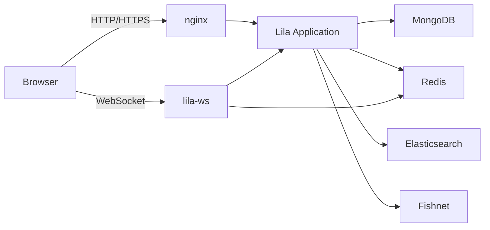
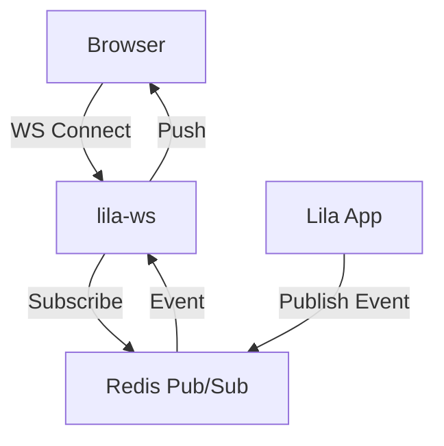
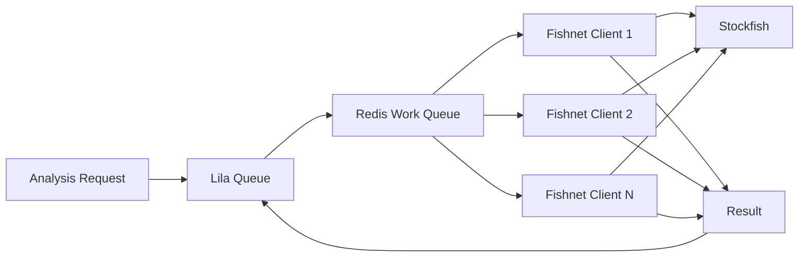

# System Architecture

Lichess is built as a modular monolith with clear separation of concerns, running on a distributed infrastructure designed for high availability and performance.

## Production Architecture

The production system consists of multiple specialized services working together:


<Note>
  This diagram represents the production architecture as of July 2022. The system handles millions of concurrent users with real-time WebSocket connections.
</Note>

### Core Components

<CardGroup cols={2}>
  <Card title="Application Servers" icon="server">
    Multiple instances of the Scala application running behind nginx, handling HTTP requests and business logic.
  </Card>
  
  <Card title="WebSocket Server" icon="network-wired">
    Separate [lila-ws](https://github.com/lichess-org/lila-ws) instances handle WebSocket connections for real-time features.
  </Card>
  
  <Card title="MongoDB Cluster" icon="database">
    Stores 4.7+ billion games, user data, and application state with replication and sharding.
  </Card>
  
  <Card title="Redis" icon="memory">
    Provides pub/sub messaging, caching, and session storage for communication between services.
  </Card>
  
  <Card title="Elasticsearch" icon="magnifying-glass">
    Indexes games and content for fast, complex search queries across billions of records.
  </Card>
  
  <Card title="Fishnet Cluster" icon="microchip">
    Distributed network of volunteer servers running Stockfish for game analysis.
  </Card>
</CardGroup>

## Application Architecture

### Technology Stack

**Backend:**
- **Language**: Scala 3 - Modern, type-safe functional programming
- **Framework**: Play 2.8 - Reactive web framework
- **Concurrency**: Akka Streams, Scala Futures - Fully asynchronous
- **Dependency Injection**: MacWire - Compile-time DI
- **Templating**: Scalatags - Type-safe HTML generation

**Frontend:**
- **Language**: TypeScript - Type-safe JavaScript
- **UI Library**: Snabbdom - Lightweight virtual DOM
- **Chess Engine**: Chessground - Custom chessboard component
- **Build**: esbuild - Fast bundling and minification
- **Styling**: Sass - Advanced CSS preprocessing

**Infrastructure:**
- **Database**: MongoDB - Document storage
- **Cache**: Redis, Caffeine, Scaffeine - Multi-tier caching
- **Search**: Elasticsearch - Full-text search
- **Proxy**: nginx - Load balancing and SSL termination
- **Monitoring**: Kamon - Metrics and tracing

### Request Flow



<Steps>
  <Step title="Client Request">
    User's browser sends HTTP request to nginx reverse proxy
  </Step>
  
  <Step title="Routing & Load Balancing">
    nginx routes request to available application server instance
  </Step>
  
  <Step title="Application Processing">
    Lila application processes request through controllers and modules
  </Step>
  
  <Step title="Data Layer">
    Application queries MongoDB for persistence, Redis for cache, Elasticsearch for search
  </Step>
  
  <Step title="Response">
    HTML rendered via Scalatags or JSON API response sent back to client
  </Step>
  
  <Step title="Real-time Updates">
    WebSocket connections via lila-ws push updates using Redis pub/sub
  </Step>
</Steps>

## Code Architecture

### Modular Monolith

Lichess uses a modular monolith architecture with 85 modules organized in a dependency hierarchy:

```scala
// Module dependency levels (build.sbt:60-86)
lazy val modules = Seq(
  // Level 1 - Foundation
  core, coreI18n,
  
  // Level 2 - UI & Common utilities
  ui, common, tree,
  
  // Level 3 - Infrastructure  
  db, room, search,
  
  // Level 4 - Core services
  memo, rating,
  
  // Level 5 - Domain modules
  game, gathering, study, user, puzzle, analyse,
  report, pref, chat, playban, lobby, mailer, oauth,
  
  // Level 6+ - Feature modules
  tournament, round, swiss, relay, team, forum,
  streamer, simul, activity, msg, ublog, notifyModule,
  clas, perfStat, opening, timeline, setup, video,
  fide, title, push, pool, relation, tv, coordinate,
  feed, history, recap, shutup, appeal, irc, explorer,
  learn, event, coach, practice, evalCache, irwin,
  bot, racer, cms, i18n, jsBot, socket, bookmark,
  studySearch, gameSearch, forumSearch, teamSearch
)
```

### Module Structure

Each module follows a consistent structure:

```
modules/
├── game/
│   └── src/
│       └── main/
│           └── scala/
│               ├── Env.scala          # Module initialization
│               ├── GameRepo.scala     # Database access
│               ├── GameApi.scala      # Business logic
│               └── ...
├── puzzle/
├── tournament/
└── ...
```

### Dependency Injection

Lichess uses MacWire for compile-time dependency injection. All modules are wired together in `app/Env.scala`:

```scala
final class Env(
    val config: Configuration,
    val controllerComponents: ControllerComponents,
    environment: Environment,
    shutdown: akka.actor.CoordinatedShutdown,
    cookieBaker: SessionCookieBaker
)(using val system: akka.actor.ActorSystem, val executor: Executor):

  // Wire all modules in dependency order
  val i18n: lila.i18n.Env.type = lila.i18n.Env
  val mongo: lila.db.Env = wire[lila.db.Env]
  val memo: lila.memo.Env = wire[lila.memo.Env]
  val socket: lila.socket.Env = wire[lila.socket.Env]
  val user: lila.user.Env = wire[lila.user.Env]
  val security: lila.security.Env = wire[lila.security.Env]
  val game: lila.game.Env = wire[lila.game.Env]
  val tournament: lila.tournament.Env = wire[lila.tournament.Env]
  val round: lila.round.Env = wire[lila.round.Env]
  // ... 80+ more modules
```

### Application Bootstrap

The application entry point initializes all components:

```scala
// app/Lila.scala:18-26
object Lila:
  def main(args: Array[String]): Unit =
    lila.web.PlayServer.start(args): env =>
      LilaComponents(
        env,
        DefaultApplicationLifecycle(),
        Configuration.load(env)
      ).application

final class LilaComponents(
    val environment: Environment,
    val applicationLifecycle: ApplicationLifecycle,  
    val configuration: Configuration
) extends BuiltInComponents:
  
  // Initialize environment with all modules
  val env: lila.app.Env =
    lila.log("boot").info(s"Start loading lila modules")
    val c = lila.common.Chronometer.sync(wire[lila.app.Env])
    lila.log("boot").info(s"Loaded lila modules in ${c.showDuration}")
    c.result
    
  // Wire up all controllers
  lazy val account: Account = wire[Account]
  lazy val analyse: Analyse = wire[Analyse]
  lazy val game: Game = wire[Game]
  lazy val tournament: Tournament = wire[Tournament]
  // ... all controllers
```

## Data Layer

### MongoDB Schema

Lichess uses MongoDB with collections for different domains:

- `game5` - Game records (4.7+ billion documents)
- `user4` - User accounts and profiles  
- `tournament2` - Tournament data
- `puzzle2` - Puzzle database
- `study` - Analysis studies
- `chat` - Chat messages
- `forum_post` - Forum content

### Repository Pattern

Each module typically includes a repository for database access:

```scala
// Example repository pattern
final class GameRepo(val coll: Coll)(using Executor):
  
  def game(gameId: GameId): Fu[Option[Game]] =
    coll.byId[Game](gameId)
    
  def recent(nb: Int): Fu[List[Game]] =
    coll
      .find($empty)
      .sort($sort.desc("createdAt"))
      .cursor[Game]()
      .list(nb)
```

### Caching Strategy

Multi-tier caching reduces database load:

<CardGroup cols={3}>
  <Card title="L1: Caffeine" icon="1">
    In-memory cache within application JVM
  </Card>
  
  <Card title="L2: Redis" icon="2">
    Distributed cache shared across app servers
  </Card>
  
  <Card title="L3: MongoDB" icon="3">
    Persistent data store with indexes
  </Card>
</CardGroup>

```scala
// modules/memo/src/main/scala/CacheApi.scala
final class CacheApi(
    redis: RedisClient,
    caffeine: CaffeineCache
):
  def apply[A](ttl: FiniteDuration)(fetch: => Fu[A]): A =
    caffeine.get(key, _ => redis.get[A](key) getOrElse fetch)
```

## Real-time Communication

### WebSocket Architecture

Real-time features use a separate WebSocket server (lila-ws):



**Key features:**
- Handles millions of concurrent connections
- Written in Scala for performance
- Uses Redis pub/sub for event distribution
- Separate from main app for scalability

### Event Flow

<Steps>
  <Step title="Client subscribes">
    Browser establishes WebSocket connection to lila-ws
  </Step>
  
  <Step title="Subscribe to channels">
    lila-ws subscribes to relevant Redis channels (e.g., game:abc123)
  </Step>
  
  <Step title="Event occurs">
    Game move made - lila app publishes to Redis: `game:abc123`
  </Step>
  
  <Step title="Event distribution">
    Redis pub/sub broadcasts to all subscribed lila-ws instances
  </Step>
  
  <Step title="Push to clients">
    lila-ws pushes update to connected browsers watching that game
  </Step>
</Steps>

## Analysis Infrastructure

### Fishnet - Distributed Analysis

Stockfish analysis is distributed across volunteer servers:



**Components:**
- Analysis requests queued in Redis
- Fishnet clients poll for work
- Stockfish engine computes evaluation
- Results published back to Lila
- Cached for future requests

## Frontend Architecture

### TypeScript Modules

The `ui/` directory contains 30+ independent TypeScript modules:

```
ui/
├── analyse/         # Analysis board
├── chat/           # Chat widget  
├── chess/          # Core chess logic
├── chessground/    # Board rendering
├── dasher/         # User menu
├── lobby/          # Game lobby
├── puzzle/         # Puzzle trainer
├── round/          # Live game
├── site/           # Global site code
├── tournament/     # Tournament pages
└── ...
```

### Build System

Frontend builds use esbuild for speed:

```bash
# ui/build script
./build              # Build all modules
./build -w           # Watch mode
./build analyse      # Build specific module
```

Package.json configuration:

```json
{
  "engines": {
    "node": ">=24",
    "pnpm": "10"
  },
  "dependencies": {
    "@lichess-org/chessground": "^10.0.2",
    "@lichess-org/pgn-viewer": "^2.5.9",
    "snabbdom": "3.5.1",
    "typescript": "^5.9.3"
  }
}
```

### Chessground

Custom chessboard component features:
- Drag & drop piece movement
- Premoves and conditional moves  
- Analysis arrows and highlights
- Mobile touch support
- Accessibility features

## Performance Optimizations

<CardGroup cols={2}>
  <Card title="Async Everything" icon="bolt">
    All I/O operations are non-blocking using Scala Futures and Akka Streams
  </Card>
  
  <Card title="Smart Caching" icon="memory">
    Multi-tier caching with Caffeine (in-process) and Redis (distributed)
  </Card>
  
  <Card title="Database Indexes" icon="database">
    Strategic MongoDB indexes for common query patterns
  </Card>
  
  <Card title="CDN Assets" icon="globe">
    Static assets served via CDN with aggressive caching
  </Card>
  
  <Card title="Code Splitting" icon="scissors">
    Frontend modules loaded on-demand, not in one bundle
  </Card>
  
  <Card title="Connection Pooling" icon="plug">
    Reused connections to MongoDB, Redis, and external services
  </Card>
</CardGroup>

## Monitoring & Observability

### Kamon Integration

Production monitoring with Kamon:

```scala
// app/Lila.scala:197-199
if configuration.get[Boolean]("kamon.enabled") then
  lila.log("boot").info("Kamon is enabled")
  kamon.Kamon.init()
```

**Metrics collected:**
- Request rates and latencies
- Database query performance  
- Cache hit/miss rates
- WebSocket connection counts
- JVM memory and GC stats

### Configuration

```scala
// build.sbt:51-55 - Monitoring dependencies
libraryDependencies ++= Seq(
  kamon.core,
  kamon.influxdb,  
  kamon.metrics,
  kamon.prometheus
)
```

## Deployment

### Build & Package

```bash
# Create production build
sbt compile
sbt stage

# Build Docker image (if using containers)
sbt docker:publishLocal
```

### Configuration

Production configuration in `conf/application.conf`:

```hocon
include "base"
include "version"

# Production overrides
http.port = 9663
net.domain = "lichess.org"
mongo.uri = "mongodb://..."
redis.uri = "redis://..."
```

## Scalability Considerations

<AccordionGroup>
  <Accordion title="Horizontal Scaling">
    Multiple application instances behind load balancer
    - Stateless application servers
    - Shared Redis for session state
    - MongoDB replica sets for read scaling
  </Accordion>
  
  <Accordion title="Database Sharding">
    MongoDB collections sharded by key:
    - Games sharded by game ID
    - Users sharded by user ID  
    - Ensures even distribution
  </Accordion>
  
  <Accordion title="WebSocket Isolation">
    Separate WebSocket servers:
    - Dedicated resources for real-time
    - Independent scaling from HTTP
    - Reduced impact of connection churn
  </Accordion>
  
  <Accordion title="Async Processing">
    Background job processing:
    - Analysis requests queued
    - Email sending async
    - Tournament pairing calculated off-request
  </Accordion>
</AccordionGroup>

## Security Architecture

- **Authentication**: BCrypt password hashing, OAuth2 support
- **Session Management**: Signed cookies, Redis-backed sessions
- **Rate Limiting**: Per-IP and per-user limits via NetConfig
- **Input Validation**: Type-safe parsing with Scala
- **CSRF Protection**: Play Framework CSRF tokens
- **Proxy Detection**: IP2Proxy database integration

## Further Reading

<CardGroup cols={2}>
  <Card title="Module Deep Dive" icon="books" href="/modules/overview">
    Detailed documentation for each module
  </Card>
  
  <Card title="API Documentation" icon="code" href="/api/overview">
    Internal APIs and integration points
  </Card>
  
  <Card title="Contributing Guide" icon="code-pull-request" href="https://github.com/lichess-org/lila/blob/master/CONTRIBUTING.md">
    How to contribute to Lichess
  </Card>
  
  <Card title="GitHub Wiki" icon="book" href="https://github.com/lichess-org/lila/wiki">
    Additional development resources
  </Card>
</CardGroup>