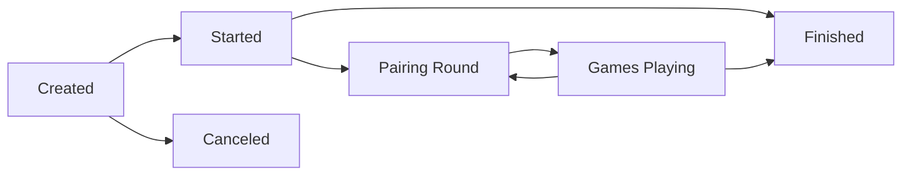

The **tournament** module manages tournament creation, player registration, automatic pairing, and leaderboard tracking for Lichess tournaments.

## Core Types

### Tournament

From `modules/tournament/src/main/Tournament.scala`:

```scala
case class Tournament(
    id: TourId,
    name: String,
    status: Status,                    // Created, Started, Finished
    clock: ClockConfig,                // Time control
    minutes: Int,                      // Tournament duration
    variant: chess.variant.Variant,    // Standard, Blitz, etc.
    position: Option[Fen.Standard],    // Starting position
    rated: Rated,                      // Rated or casual
    password: Option[String] = None,
    conditions: TournamentCondition.All,
    teamBattle: Option[TeamBattle] = None,
    noBerserk: Boolean = false,
    noStreak: Boolean = false,
    schedule: Option[Scheduled],
    nbPlayers: Int,
    createdAt: Instant,
    createdBy: UserId,
    startsAt: Instant,
    winnerId: Option[UserId] = None,
    featuredId: Option[GameId] = None,
    spotlight: Option[Spotlight] = None,
    description: Option[String] = None,
    hasChat: Boolean = true
) extends lila.core.tournament.Tournament
```

### Tournament Status

```scala
enum Status:
  case created   // Accepting registrations
  case started   // In progress
  case finished  // Completed
```

### Key Methods

```scala
extension (t: Tournament)
  def isCreated = status == Status.created
  def isStarted = status == Status.started
  def isFinished = status == Status.finished
  def isEnterable = !isFinished

  def isPrivate = password.isDefined
  
  def isTeamBattle = teamBattle.isDefined
  def isTeamRelated = isTeamBattle || conditions.teamMember.isDefined
  
  def finishesAt = startsAt.plusMinutes(minutes)
  
  def secondsToStart = Seconds((startsAt.toSeconds - nowSeconds).toInt.atLeast(0))
  
  def secondsToFinish = Seconds((finishesAt.toSeconds - nowSeconds).toInt.atLeast(0))
  
  def progressPercent: Int =
    if isCreated then 0
    else if isFinished then 100
    else
      val total = minutes * 60
      val remaining = secondsToFinish.value
      100 - (remaining * 100 / total)
  
  def pairingsClosed = 
    secondsToFinish < Seconds(math.max(30, math.min(clock.limitSeconds.value / 2, 120)))
  
  def isStillWorthEntering = isEnterable && {
    isMarathon || isUnique || {
      secondsToFinish > Seconds((minutes * 60 / 3).atMost(20 * 60))
    }
  }
```

## Tournament Types

### Schedule Frequencies

```scala
// From modules/tournament/src/main/Schedule.scala
enum Freq:
  case Hourly
  case Daily
  case Weekly
  case Monthly
  case Shield      // Monthly variant shields
  case Marathon    // Special long tournaments
  case Unique      // One-off special events
```

### Speed Categories

```scala
enum Speed:
  case UltraBullet
  case Bullet
  case SuperBlitz
  case Blitz
  case Rapid
  case Classical

object Speed:
  def fromClock(clock: ClockConfig): Speed = ???
```

## Players and Pairings

### Player

From `modules/tournament/src/main/Player.scala`:

```scala
case class Player(
    id: TourPlayerId,
    tourId: TourId,
    userId: UserId,
    rating: IntRating,
    provisional: Boolean,
    withdraw: Boolean = false,
    score: Int = 0,
    fire: Boolean = false,
    performance: Option[IntRating] = None
):
  def active = !withdraw
  def is(uid: UserId): Boolean = uid == userId
  def doWithdraw = copy(withdraw = true)
```

### Pairing

From `modules/tournament/src/main/Pairing.scala`:

```scala
case class Pairing(
    id: GameId,
    tourId: TourId,
    status: chess.Status,
    user1: UserId,
    user2: UserId,
    winner: Option[UserId],
    turns: Option[Ply],
    berserk1: Boolean = false,
    berserk2: Boolean = false
):
  def gameId = id
  
  def users = List(user1, user2)
  
  def contains(user: UserId): Boolean = 
    user1 == user || user2 == user
  
  def notContains(user: UserId) = !contains(user)
  
  def finished = status >= Status.Mate
  
  def playing = !finished
  
  def quickFinish = finished && turns.exists(_ < Ply(10))
```

## Automatic Pairing

From `modules/tournament/src/main/AutoPairing.scala`:

```scala
object AutoPairing:
  
  def apply(
      tour: Tournament,
      players: RankedPlayers,
      pairings: List[Pairing]
  ): List[Pairing.Prep] =
    // Complex algorithm to pair players optimally
    // Considers:
    // - Player ratings (similar strength)
    // - Color history (alternating colors)
    // - Avoid rematches
    // - Player availability
    ???
```

### Color History

```scala
// From modules/tournament/src/main/ColorHistory.scala
case class ColorHistory(results: List[Option[Color]]):
  
  def firstGetsWhite(other: ColorHistory): Option[Boolean] =
    // Determine who should get white based on recent color history
    ???
  
  def sameColors(other: ColorHistory): Boolean =
    // Check if both players had same recent colors
    ???
```

## Tournament Organizers

### CreatedOrganizer

Manages tournaments before they start:

```scala
// From modules/tournament/src/main/CreatedOrganizer.scala
final class CreatedOrganizer(
    api: TournamentApi,
    socket: TournamentSocket
)(using Executor):
  
  def start(tour: Tournament): Fu[Tournament] =
    // Initialize tournament
    // Send notifications
    // Create first round pairings
    ???
```

### StartedOrganizer

Manages ongoing tournaments:

```scala
// From modules/tournament/src/main/StartedOrganizer.scala  
final class StartedOrganizer(
    api: TournamentApi,
    pairingApi: PairingApi,
    socket: TournamentSocket
)(using Executor):
  
  def tick(tour: Tournament): Funit =
    // Create new pairings
    // Update standings
    // Check if tournament should finish
    ???
  
  def createPairings(tour: Tournament): Fu[List[Pairing]] =
    for
      players <- api.rankedPlayers(tour)
      pairings <- AutoPairing(tour, players, ???)
    yield pairings
```

## Leaderboards

### LeaderboardApi

From `modules/tournament/src/main/LeaderboardApi.scala`:

```scala
final class LeaderboardApi(
    coll: Coll,
    indexer: LeaderboardIndexer
)(using Executor):
  
  def getAndDeleteOld(userId: UserId): Fu[Leaderboard] =
    // Fetch user's tournament results
    // Clean up old entries
    ???
  
  def chart(user: User): Fu[Option[ChartData]] =
    // Generate performance chart data
    ???
```

### Leaderboard Types

```scala
case class Leaderboard(
    entries: List[Entry],
    userId: UserId
)

case class Entry(
    tourId: TourId,
    tourName: String,
    nbPlayers: Int,
    rank: Int,
    rankPercent: Int,
    score: Int,
    performance: Option[IntRating],
    date: Instant
)
```

## Team Battles

```scala
case class TeamBattle(
    teams: Set[TeamId],
    nbLeaders: Int  // Number of top players per team to count
):
  def hasEnoughTeams = teams.size > 1
```

## Conditions

Tournaments can have entry requirements:

```scala
case class TournamentCondition(
    nbRatedGame: Option[Condition.NbRatedGame],
    maxRating: Option[Condition.MaxRating],
    minRating: Option[Condition.MinRating],
    titled: Option[Condition.Titled],
    teamMember: Option[Condition.TeamMember],
    allowList: Option[Condition.AllowList]
)

object Condition:
  case class NbRatedGame(perf: Option[PerfKey], nb: Int)
  case class MaxRating(perf: PerfKey, rating: IntRating)
  case class MinRating(perf: PerfKey, rating: IntRating)
  case class Titled()
  case class TeamMember(teamId: TeamId)
  case class AllowList(value: String)
```

## Spotlight Tournaments

```scala
// From modules/tournament/src/main/Spotlight.scala
case class Spotlight(
    headline: String,
    description: String,
    homepageHours: Option[Int] = None,
    iconFont: Option[String] = None,
    iconImg: Option[String] = None
)
```

## Tournament Lifecycle



### Key Events

1. **Creation** - Tournament is created and published
2. **Registration** - Players join before start time
3. **Start** - Initial pairings created
4. **Pairing Rounds** - New pairings every few minutes
5. **Game Completion** - Update scores and standings
6. **Finish** - No more pairings, determine winners

## Repositories

### PlayerRepo

```scala
final class PlayerRepo(coll: Coll)(using Executor):
  
  def join(tourId: TourId, player: Player): Funit
  
  def withdraw(tourId: TourId, userId: UserId): Funit
  
  def find(tourId: TourId, userId: UserId): Fu[Option[Player]]
  
  def rankedPlayers(tourId: TourId, max: Int): Fu[RankedPlayers]
```

### PairingRepo

```scala
final class PairingRepo(coll: Coll)(using Executor):
  
  def insert(pairing: Pairing): Funit
  
  def finish(pairing: Pairing): Funit
  
  def findPlaying(tourId: TourId): Fu[List[Pairing]]
  
  def opponentsOf(tourId: TourId, userId: UserId): Fu[Set[UserId]]
```

## Performance Optimizations

1. **Cached standings** - Leaderboard cached and updated incrementally
2. **Indexed queries** - Fast lookup of players and pairings
3. **Batched updates** - Group score updates
4. **WebSocket updates** - Real-time tournament state
5. **Sharded tournaments** - Large tournaments spread across servers

## JSON Views

From `modules/tournament/src/main/JsonView.scala`:

```scala
final class JsonView(
    userApi: lila.user.UserApi,
    cached: Cached
)(using Executor):
  
  def apply(
      tour: Tournament,
      page: Option[Int],
      me: Option[User],
      partial: Boolean
  ): Fu[JsObject] =
    // Generate JSON for tournament view
    ???
  
  def standing(tour: Tournament, page: Int): Fu[JsObject] =
    // Generate leaderboard JSON
    ???
```

## Module Dependencies

### Dependencies
- **game** - Tournament games
- **user** - Player data
- **team** - Team battles
- **rating** - Rating calculations
- **chat** - Tournament chat
- **socket** - Real-time updates

### Dependents
- **api** - Tournament API
- **simul** - Similar pairing logic
- **swiss** - Swiss tournament variant

## Related Modules

<CardGroup cols={2}>
  <Card title="Swiss Module" icon="chess-board" href="/modules/swiss">
    Swiss-style tournament system
  </Card>
  <Card title="Game Module" icon="chess" href="/modules/game">
    Core game logic for tournament games
  </Card>
</CardGroup>